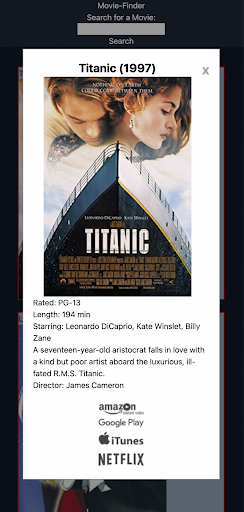

# Movie Finder 

## Description  
Welcome to Movie Finder! This web application allows anyone to search for a movie and find any streaming services that is currently streaming it. With each movie search, a grid of movies matching the search input. Simply click on a movie from the search results and a display with movie details and available streaming services will generate.

## Screenshot

| Mobile Search Results| Mobile Selected Movie |
|:------------:|:-----------:|
|||
| **Desktop Search Results** | **Desktop Selected Movie** |
| | 

## Deployed Application
[https://darioorbita.github.io/Movie-Finder/](https://darioorbita.github.io/Movie-Finder/)

## Usage  
### 1. Enter a movie you want to find into the search
  
### 2. Find the movie you are looking for (Or maybe a hidden gem!)  

### 3. And that's it!

